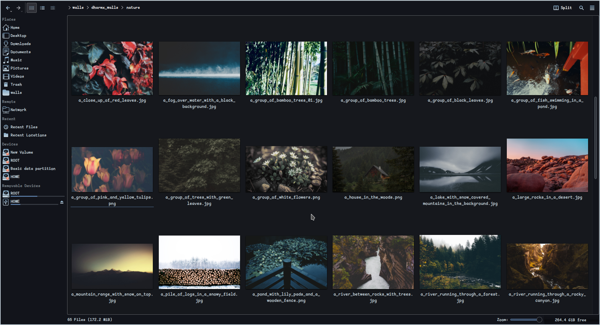
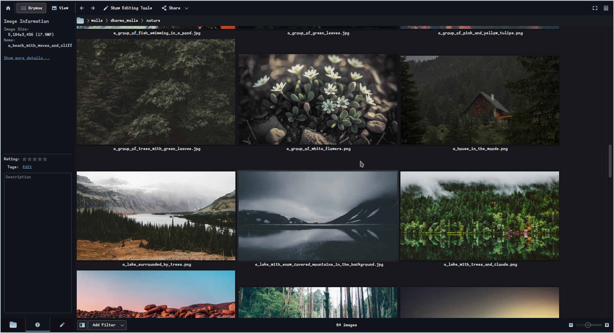

# Image Processing with Microsoft Vision API

This Bash script facilitates image processing using the Microsoft Vision API. It analyzes images and generates captions based on their content. The script can handle single images or process all images within a specified directory.


https://github.com/Sahil-958/content_aware_renaming/assets/118348625/e9ad943e-86ab-440f-9cf9-8930b7bc86c4


## Here is Some work done by it 
|| |
|---------|---------|
|  |  |
| *Grouped 1* | *Grouped 2* |
|  |  |
| *a_black_and_white_drawing_of_a_person_with_a_blindfold*| *a_white_drawing_of_a_person_with_a_mask_on_his_head* |


### Logs Structure

- Sceneraio 1:
    ```
    Error: File '/home/sawhill/walls/dharmx_walls/nature/no_image_here.png' does not exist.
    No image files found in directory and it's sub directories: /home/sawhill/Templates/
    ```

- Sceneraio 2:

    ```
    Renaming [img1.png] to [a_colorful_sky_with_clouds.png]
    Renaming [img2.jpg] to [a_mountain_with_snow_on_it.jpg]
    Renaming [img3.png] to [a_person_sitting_on_a_horse_next_to_a_lamp_post.png]
    Renaming [wallheaven.png] to [a_tower_in_a_forest.png]
    Renaming [wall.png] to [a_yellow_moon_in_the_sky.png]
    ```

- Sceneraio 3:

    ```
    Old name:[a_person_playing_a_guitar.png] == new name:[a_person_playing_a_guitar.png] Skipped
    Old name:[a_stone_walkway_leading_to_a_lighthouse.jpg] == new name:[a_stone_walkway_leading_to_a_lighthouse.jpg] Skipped
    ```

- Sceneraio 4:

    ```
    Skipping image [/home/sawhill/wall/remote/unsorted/a_bicycle_parked_on_a_street.jpg]
    Reason: Access denied due to invalid subscription key or wrong API endpoint. Make sure to provide a valid key for an active subscription and use a correct regional API endpoint for your resource. 
    Skipping image [/home/sawhill/wall/remote/monochrome/a_black_rose_with_a_black_background.jpg]
    Reason: Access denied due to invalid subscription key or wrong API endpoint. Make sure to provide a valid key for an active subscription and use a correct regional API endpoint for your resource. 
    ```


## Prerequisites

Before using this script, ensure you have the following:

1. **Microsoft Vision API Key**: Obtain an API key from the Microsoft Azure portal. This key is required for accessing the Microsoft Vision API.

2. **Microsoft Vision API Endpoint**: You need the URL of the Microsoft Vision API endpoint. This endpoint will be used to send requests for image analysis.

3. **Bash Environment**: The script is written in Bash, so make sure you have a Bash-compatible environment available. It should work on most Unix-like operating systems, including Linux and macOS.

4. **jq**: The script utilizes `jq` for parsing JSON responses from the Microsoft Vision API. Ensure `jq` is installed on your system. You can install it via package managers like `apt`, `brew`, or by downloading it from the official website.

## Getting Started

Follow these steps to use the script:

1. **Get the Script**: You can directly copy pase or use below command.

    ```bash
    curl -fsSL https://raw.githubusercontent.com/Sahil-958/content_aware_renaming/main/renamer.sh > renamer.sh && chmod +x renamer.sh
    ```

2. **Verify the contents**: Verify the contents of script.

    ```bash
    cat renamer.sh | less
    ```

3. **Set up API Key and Endpoint**:  You can Speicfy that in three ways:   

    - Open the script (`renamer.sh`) in a text editor. Replace the placeholders for `MICROSOFT_VISION_API_KEY` and `MICROSOFT_VISION_API_ENDPOINT` with your actual API key and endpoint URL.

    - Use the `-endpoint` and `-key` Flags to speicfy the api endpoint and key 
      
    - Use the `-endpiont` and `-kf` Flags to specify key and endpoint the diff between `-kf` and `-key` is the `-kf` just let you speicfy that file for api key so the key doen't goes in your bash history and eliminate a potential risk of it might get stolen

> [!CAUTION]
> When you use -key flag you are giving api key as plain text which gets stored in you shell history

4. **Run the Script**: Execute the script with appropriate options based on your requirements. See the usage section below for details on available options.

    ```bash
    ./renamer.sh [options] <image_directory>
    ```

## Usage

The script supports various command-line options:

- `-h`: Print usage information.
- `-key <API_KEY>`: Set the Microsoft Vision API key.
- `-kf <API_KEY FILE>`: Set the Microsoft Vision API key from a file.
- `-endpoint <ENDPOINT_URL>`: Set the Microsoft Vision API endpoint URL.
- `-p <NUM>`: Set the concurrency level (maximum number of images to process concurrently). Default is 3.
- `-r <RESPONSE_FILE>`: Save API responses to a file.
- `-l <LOG_FILE>`: Save logs to a file.
- `-sr <REPLACEMENT>`: Specify a replacement character for spaces in image names.
- `-sf <SINGLE_FILE>`: Process a single image file instead of a directory.
- `-d <DEPTH>`: Set the depth of subdirectories to search for images. By Default all subdirectories are searched if depth is not specified or set to 0.

Example usage:

```bash
./renamer.sh -p 5 -sr _ -r responses.txt -l logs.txt -key api_key.txt -endpoint "https://example.cognitiveservices.azure.com" ~/Pictures/
```

> [!NOTE]  
> - The script will decends to all the subdirs inside a dir to fetch all the images 
> - The max size of images supported by Microsoft is 20.97 MB 
> - The Vision Api works best with natural images
> - Set concurrency to low if the using free tire as only 20 class per minutes is available for free tier

> [!CAUTION]
> It uploads the images to Microsoft servers, do not use it with sensitive images. (or use it with caution) 

## Credits and Improvements

Originally inspired from https://github.com/sanjujosh/auto-image-renamer/ which is written in python.

While the core functionality remains the same, several improvements have been made in this version:

- **Added Support for Single Image Processing**: You can now process a single image file instead of a directory.
- **Enhanced Concurrency Control**: Improved concurrency management for efficient processing of multiple images concurrently.
- **Extended Error Handling**: Enhanced error handling for better resilience and stability.
- **Improved Documentation**: Enhanced README.md file with detailed instructions, usage examples, and additional information.
- **Added API Key Privacy Option**: Option to read the API key from a separate file for improved security, particularly in screen recording scenarios and active bash histories.
- **Added Multiple API Version**: Option to select api versions and modes. Note: not available through flags
- **Added Response and Log File Options**: Ability to save API responses and logs to specified files for better analysis and debugging.

## Additional Information

- **API Documentation**: You can find detailed documentation for the Microsoft Vision API [here](https://eastus.dev.cognitive.microsoft.com/docs/services/Cognitive_Services_Unified_Vision_API_2023-10-01/operations/61d65934cd35050c20f73ab6).

These improvements aim to enhance the usability, performance, and security of the script. Contributions and feedback are always welcome!
